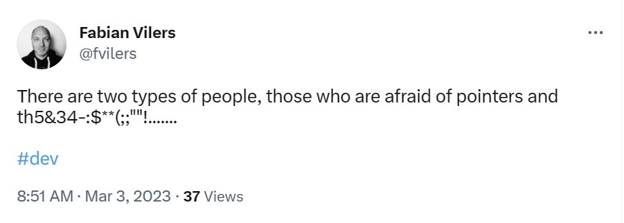
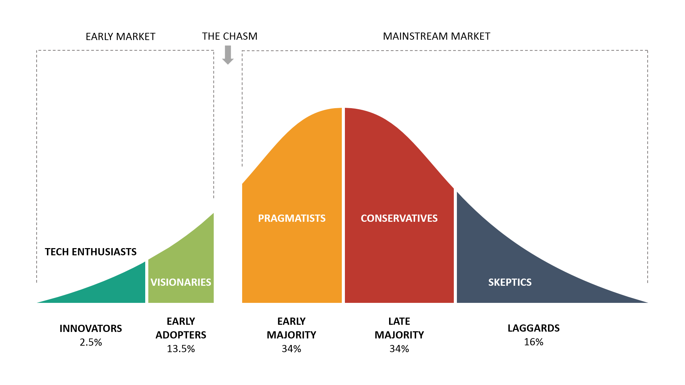

<!-- _footer: Photo by <a href="https://unsplash.com/@lukehodde?utm_source=unsplash&utm_medium=referral&utm_content=creditCopyText">Luke Hodde</a> on <a href="https://unsplash.com/photos/VC-VBll6UQM?utm_source=unsplash&utm_medium=referral&utm_content=creditCopyText">Unsplash</a> -->

# Rust

Pourquoi vous devriez vous y intéresser en 2023

<small>[Fabian Vilers](https://github.com/fvilers)
Software Craft Luxembourg</small>

<!--
- Y a-t-il des développeurs C/C++ dans la salle ?
- Y a-t-il des développeurs Web dans la salle ?
- Y a-t-il des développeurs en embarqué dans la salle ?
-->

---

# Qui suis-je

- Développeur chevronné depuis plus de 25 ans
- [Freelance](https://www.dev-one.com/) depuis 13 ans
- Entrepreneur, passionné du web, photographe amateur, père de deux filles, gamer, et l'humain d'un Akita Inu
- Suivez moi (@fvilers) sur [GitHub](https://github.com/fvilers), [Twitter](https://twitter.com/fvilers), ou [Instagram](https://www.instagram.com/fvilers)
- Soyons connectés sur [LinkedIn](https://www.linkedin.com/in/fvilers)

---

# Agenda

- Présentation de Rust et de son écosystème
- Avantages et inconvénients
- Applications potentielles
- Opportunités professionnelles
- Et si on écrivait un peu de code ?
- Resources pour continuer

---

# Pourquoi Rust ?

- Utilisé et supporté par [AWS](https://aws.amazon.com/developer/language/rust/), [Firefox](https://hacks.mozilla.org/2019/02/rewriting-a-browser-component-in-rust/), [Deno](https://github.com/denoland/deno), le noyau de [Linux](https://thenewstack.io/rust-in-the-linux-kernel/), [Dropbox](https://dropbox.tech/application/why-we-built-a-custom-rust-library-for-capture), [Cloudflare](https://blog.cloudflare.com/introducing-oxy/), [Discord](https://discord.com/blog/why-discord-is-switching-from-go-to-rust) et bien d'autres
- Disponible sur de [multiples plateformes](https://doc.rust-lang.org/nightly/rustc/platform-support.html)
- Langage le plus apprécié auprès des développeurs depuis 7 années consécutives dans [l'enquête annuelle](https://survey.stackoverflow.co/2022/#section-most-loved-dreaded-and-wanted-programming-scripting-and-markup-languages) de Stack Overflow
- Recommandé par la [NSA](https://www.theregister.com/2022/11/11/nsa_urges_orgs_to_use/)

<!--
- Anecdote de l’ascenseur
- Pas de null/undefined
- Pas de pointeurs invalides, dépassement de mémoire, double free, data race, etc.
-->

---

# Avantages

- Performance
- Fiabilité
- Productivité
- Versatilité
- Pérennité
- Durabilité

<!--
- Performance: pas de runtime, ni de garbage collector, zero-cost abstractions
- Fiabilité: immutable par défaut, thread-safe et memory-safe
- Productivité: documentation, compilateur, package manager, linter, crates.io, LSP,,...
- Versatilité: de nombreux types d'applications peuvent être réalisés
- Pérennité: stabilité sans stagnation, cycle de 6 semaines, pas de Rust 2.0
- Durabilité: https://aws.amazon.com/blogs/opensource/sustainability-with-rust/
-->

---

---

# Inconvénients

- Courbe d'apprentissage
- Syntaxe particulière
- Durée de compilation
- Manque de maturité dans l'écriture de GUI multi plateformes

---

# Applications potentielles

- CLI/REPL/TUI
- Smart contracts/Blockchain
- Serveur web/Serverless
- Application web/WebAssembly
- Système d'exploitation
- Système embarqué
- Jeux vidéos

---

<!-- _footer: Source : https://www.helloiota.com/articles/technology-adoption -->

---

# Opportunités professionnelles

- Votre entreprise !
- [Randstad](https://www.randstad.be/en/candidates/jobs/embedded-rust-engineer_heverlee_CXAU-106273/) (Belgique)
- [Keyrock](https://keyrock.freshteam.com/jobs?location=[]&department=[%222000120408%22]&jobType=[]&title=&isRemoteLocation=false) (Belgique)
- [Sky-Hero](https://sky-hero.com/career/embedded-software-engineer/) (Belgique)
- [RustJobs](https://rustjobs.dev/) (International)
- [Reddit](https://www.reddit.com/r/rust/search/?q=%22Who%27s%20hiring%22&restrict_sr=1) (International)

---

# Et si on écrivait un peu de code ?

<!-- _footer: Photo by <a href="https://unsplash.com/@zmachacek?utm_source=unsplash&utm_medium=referral&utm_content=creditCopyText">Zdeněk Macháček</a> on <a href="https://unsplash.com/photos/PEy4qZCLXss?utm_source=unsplash&utm_medium=referral&utm_content=creditCopyText">Unsplash</a>  -->

---

# Resources pour continuer

- [Code source](https://github.com/fvilers/software-craft-luxembourg/tree/main/money_parser) annoté de la mini démo
- [The Rust Programming Language](https://doc.rust-lang.org/book/) book
- Rust Users [Forum](https://users.rust-lang.org/)
- [Reddit](https://old.reddit.com/r/rust/)
- Rust learning track sur [Exercism](https://exercism.org/tracks/rust)
- [La genèse de Rust](https://www.technologyreview.com/2023/02/14/1067869/rust-worlds-fastest-growing-programming-language/)

---

# Merci !

<!-- _footer: Présentation réalisée avec <a href="https://marp.app">Marp</a> et utilisant le theme <a href="https://draculatheme.com/marp">Dracula</a> -->

